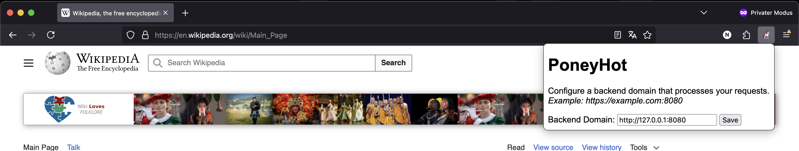
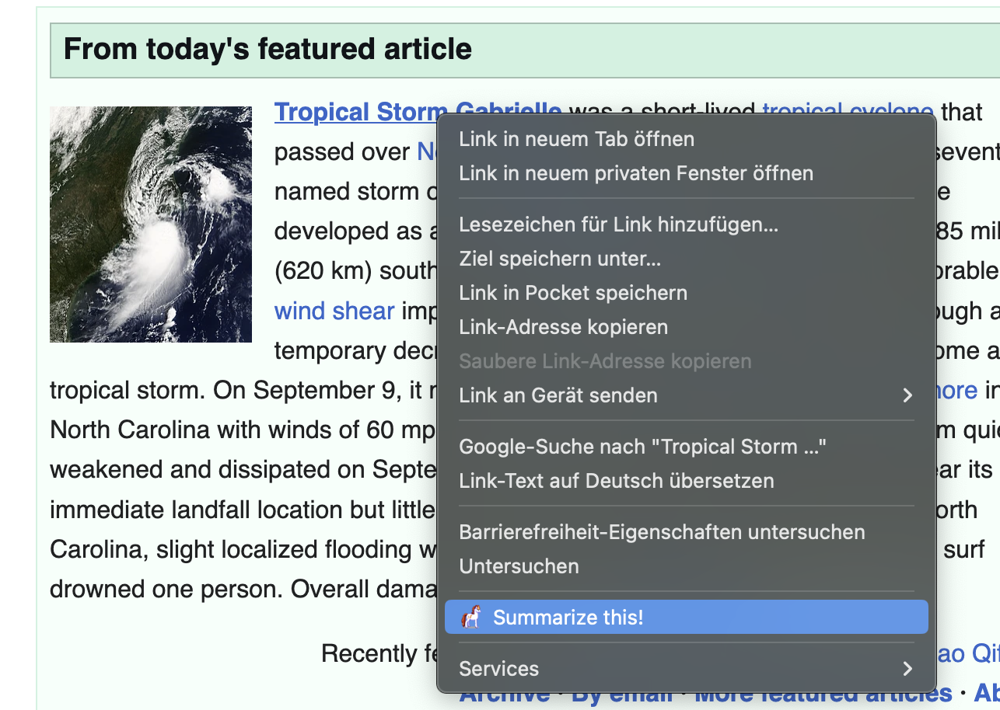
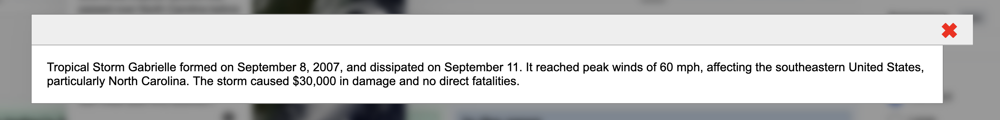
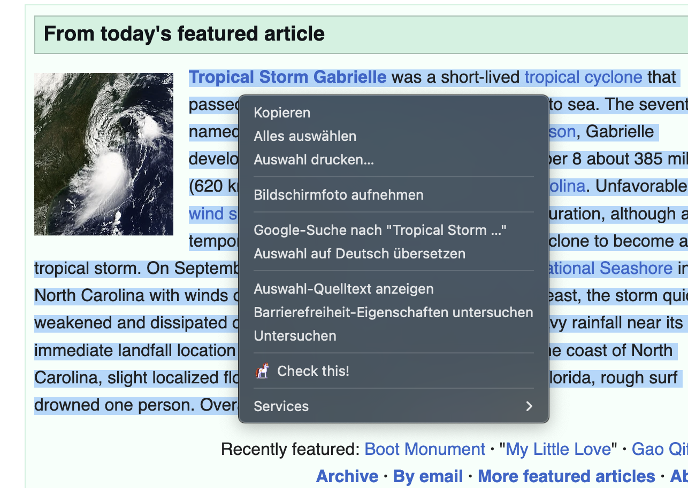
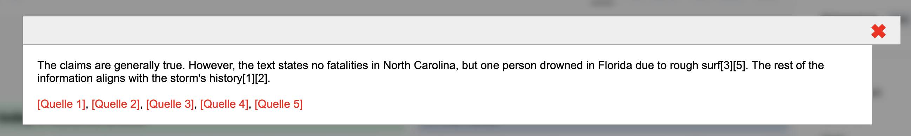
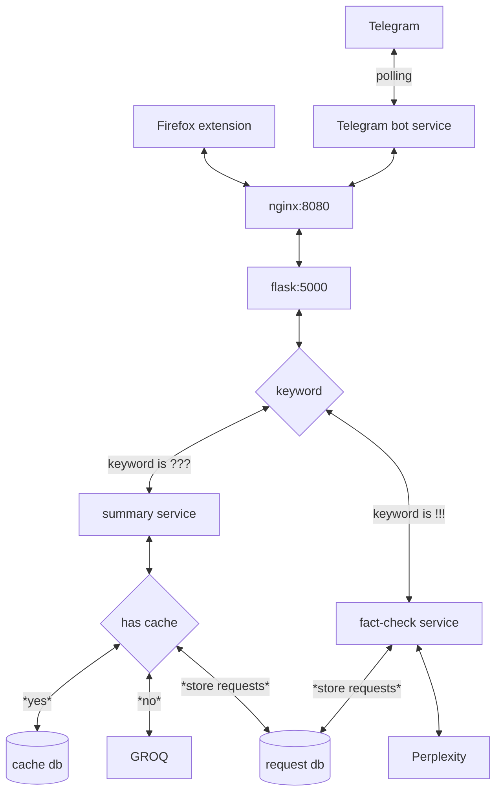

# PoneyHot

<p align="center">
    
</p>

The internet suffers from two things: **Fake News** and **Click Bait**. PoneyHot helps you cope with that by either **summarizing content** or **checking claims**. 

PoneyHot consists of three parts:
- a Dockerized backend that processes your requests
- a Firefox extension 
- a Telegram bot that allows you to easily interact with PoneyHot using your smartphone

PoneyHot requires a couple of external accounts and API keys to run properly:

- a **Groq API** key to summarize text. Groq offers a free tier, which means that summarizing is basically free.
- a **Perplexity API** key to fact-check claims. You need to purchase credit to use this feature.
- a Telegram Bot token to communicate with PoneyHot.

PoneyHot can run on your **local device**, which is sufficient if you just want to use Telegram. If you want to use the Firefox extension, your setup needs to be accessible from the internet via a public domain name.

## Prerequisites

- Obtain a Groq API key from https://groq.com/
- Top up your Perplexity credit and obtain a Perplexity API key from https://www.perplexity.ai
- Create a Telegram bot and obtain your bot token as described here: https://core.telegram.org/bots/tutorial

Clone the repository to your device:

```bash 
git clone git@github.com:nickyreinert/poneyHot.git
cd poneyHot
```

Create a `.env` file that contains a couple of important parameters. Refer to `env.example` for the *best-practice* prompts. 
```
TELEGRAM_TOKEN=123ABC

GROQ_API_KEY=123ABC
GROQ_MODEL=deepseek-r1-distill-llama-70b
GROQ_AGENT_INSTRUCTION="<refer to env.example>"
GROQ_TEMPERATURE=0 

PERPLEXITY_API_KEY=123ABC
PERPLEXITY_MODEL=sonar
PERPLEXITY_AGENT_INSTRUCTION="<refer to env.example>"
PERPLEXITY_TEMPERATURE=0

ENABLE_LOGGING=true
ENABLE_TESTING=true
LIMIT_DOCUMENT=6000

ALLOW_CHAT_IDS=123456,987654
```

> **Note on Telegram**: The Telegram chatbot works in "private mode," which means that it only responds to senders with a particular chat ID. If you contact the bot, it will respond with your chat ID. Add this chat ID to the `.env` file and restart the Docker container.

> **Note om LIMIT_DOCUMENT**: To save tokens when using the summarizing feature, text content may not exceed a given limit defined by the `LIMIT_DOCUMENT` parameter. If a text contains more characters than defined here, it will be sampled down by removing every n-th character from the document. If you have a paid subscription, you may increase this limit.

> **Note on MODELS**: Feel free to choose different models for either **Groq** or **Perplexity**. Right now, **sonar** and **deepseek-r1** are the **cheapest** options.

> **Note on ENABLE_TESTING**: If this flag is set to true, the backend will dump the summary requests to the disk. This is usefull for debugging purposes, but indeed you may disable this feature. 

Once done, start the service:

```docker compose up --build -d```

## Usage
### Firefox

Right now, you need to install the extension unofficially via `about:debugging#/runtime/this-firefox`. Just browse to and open `extensions/firefox/manifest.json`.
Click the icon on the upper menu and edit the endpoint where you installed the backend, which is either your local device or a remote server:
<p align="center">
    
</p>

You are all set. Now, when you open the context menu on a hyperlink, PoneyHot offers you to summarize the site behind it. You don't need to open the target site itself.

<p align="center">
    
</p>

After a while, you will be presented with a summary of the target website:

<p align="center">
    
</p>

If you mark a text area, the context menu offers a different context menu item that allows you to check the claim of the selected text:

<p align="center">
    
</p>

Now the results look a little different. PoneyHot returns a brief fact check as well as references: 

<p align="center">
    
</p>

### Telegram

When you created the bot using Telegram's *Botfather*, you may have already started the conversation with the bot. 

If you send the bot a message that contains a URL, it will return a summary.

If you want to explicitly ask the bot for a summary or fact check, you need to add particular prefixes to your message:

While `???` triggers a fact check, `!!!` leads to a summary. 

On your mobile device, you may use the sharing feature to send a link from your news stream to the bot to get a summary without visiting the site itself.

## Additional Information

- The summary services stores summaries to save API calls for summary requests of the same document
- The backend has the following request limit per user based on the IP address or the chat id:
    - 5 requests per 10 minutes and
    - 100 requests per day

## Architecture

